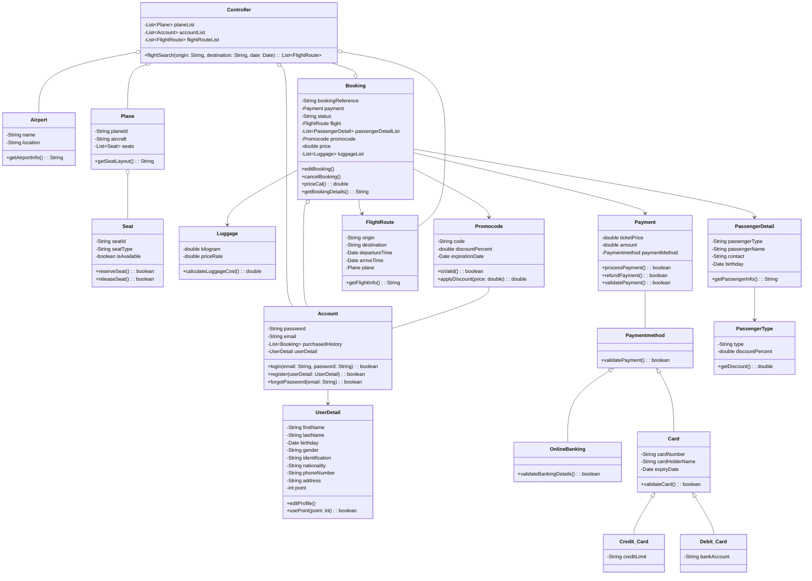

```mermaid
classDiagram
    direction TB

    %% Controller Class
    class Controller {
        -List~Plane~ planeList
        -List~Account~ accountList
        -List~FlightRoute~ flightRouteList
        +flightSearch(origin: String, destination: String, date: Date): List~FlightRoute~
    }

    %% Seat Class
    class Seat {
        -String seatId
        -String seatType
        -boolean isAvailable
        +reserveSeat(): boolean
        +releaseSeat(): boolean
    }

    %% Airport Class
    class Airport {
        -String name
        -String location
        +getAirportInfo(): String
    }

    %% Plane Class
    class Plane {
        -String planeId
        -String aircraft
        -List~Seat~ seats
        +getSeatLayout(): String
    }

    %% Booking Class
    class Booking {
        -String bookingReference
        -Payment payment
        -String status
        -FlightRoute flight
        -List~PassengerDetail~ passengerDetailList
        -Promocode promocode
        -double price
        -List~Luggage~ luggageList
        +editBooking()
        +cancelBooking()
        +priceCal(): double
        +getBookingDetails(): String
    }

    %% Luggage Class
    class Luggage {
        -double kilogram
        -double priceRate
        +calculateLuggageCost(): double
    }

    %% Payment Class
    class Payment {
        -double ticketPrice
        -double amount
        -Paymentmethod paymentMethod
        +processPayment(): boolean
        +refundPayment(): boolean
        +validatePayment(): boolean
    }

    %% Account Class
    class Account {
        -String password
        -String email
        -List~Booking~ purchasedHistory
        -UserDetail userDetail
        +login(email: String, password: String): boolean
        +register(userDetail: UserDetail): boolean
        +forgotPassword(email: String): boolean
    }

    %% UserDetail Class
    class UserDetail {
        -String firstName
        -String lastName
        -Date birthday
        -String gender
        -String identification
        -String nationality
        -String phoneNumber
        -String address
        -int point
        +editProfile()
        +usePoint(point: int): boolean
    }

    %% Payment Method Classes
    class Paymentmethod {
        +validatePayment(): boolean
    }

    class OnlineBanking {
        +validateBankingDetails(): boolean
    }

    class Card {
        -String cardNumber
        -String cardHolderName
        -Date expiryDate
        +validateCard(): boolean
    }

    class Credit_Card {
        -String creditLimit
    }

    class Debit_Card {
        -String bankAccount
    }

    %% Promocode Class
    class Promocode {
        -String code
        -double discountPercent
        -Date expirationDate
        +isValid(): boolean
        +applyDiscount(price: double): double
    }

    %% FlightRoute Class
    class FlightRoute {
        -String origin
        -String destination
        -Date departureTime
        -Date arriveTime
        -Plane plane
        +getFlightInfo(): String
    }

    %% PassengerDetail Class
    class PassengerDetail {
        -String passengerType
        -String passengerName
        -String contact
        -Date birthday
        +getPassengerInfo(): String
    }

    %% PassengerType Class
    class PassengerType {
        -String type
        -double discountPercent
        +getDiscount(): double
    }

    %% Relationships
    Controller o-- Airport 
    Controller o-- FlightRoute
    Controller o-- Plane
    Controller --o Booking

    Plane o-- Seat
    Booking --> Payment
    Booking --> PassengerDetail
    Booking --> Promocode
    Booking --> Luggage
    Booking --> FlightRoute

    PassengerDetail --> PassengerType
    Payment -- Paymentmethod
    Paymentmethod <|-- OnlineBanking
    Paymentmethod <|-- Card
    Card <|-- Credit_Card
    Card <|-- Debit_Card

    Account --o Booking
    Account --> UserDetail
    Promocode -- Account
    Account --o Controller


```